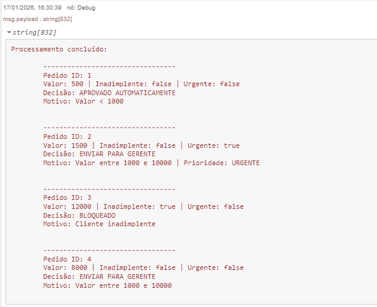

# Processamento de Pedidos – Node-RED

Projeto desenvolvido como desafio técnico para processamento de pedidos com regras de negócio, utilizando **Node-RED** e **Docker**.

## Objetivo

Receber uma lista de pedidos e aplicar regras para definir a decisão de cada um, mantendo a ordem original de entrada.

## Regras de Negócio

* Cliente inadimplente → **BLOQUEADO**
* Valor < 1000 → **APROVADO AUTOMATICAMENTE**
* Valor entre 1000 e 10000 → **ENVIAR PARA GERENTE**
* Valor > 10000 → **ENVIAR PARA DIRETORIA**

> Pedidos urgentes são identificados no payload, mas **não são reordenados**, conforme o exemplo apresentado no desafio.

## Tecnologias Utilizadas

* Node-RED
* JavaScript
* Docker
* Docker Compose

## Estrutura do Projeto

* `flows.json` → fluxo principal do Node-RED
* `docker-compose.yml` → orquestração do ambiente
* `README.md` → documentação

## Como Executar

```bash
docker compose up -d
```

Acesse o Node-RED em:

```
http://localhost:1880
```

## 📷 Foto do Resultado



## Observações

A lógica foi implementada priorizando clareza, manutenção e aderência às regras do desafio. Uma ordenação por urgência pode ser facilmente adicionada, mas foi mantida desativada por decisão de negócio.

---

Projeto desenvolvido para fins de avaliação técnica.

## 👩‍💻 Desenvolvido por
Laura Cattabriga
